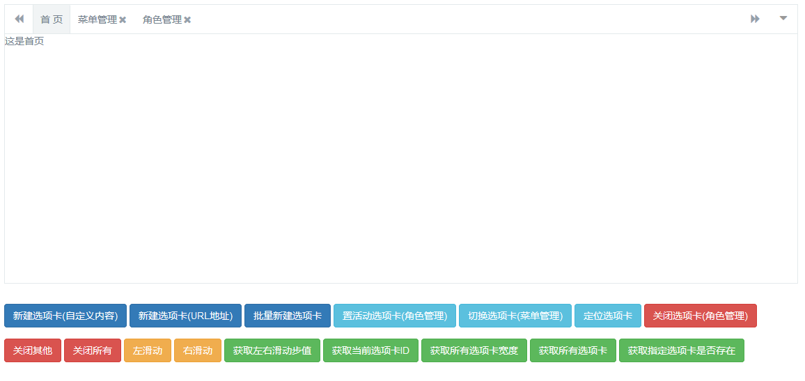
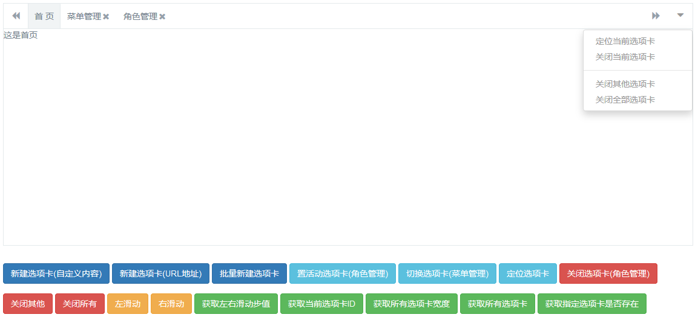
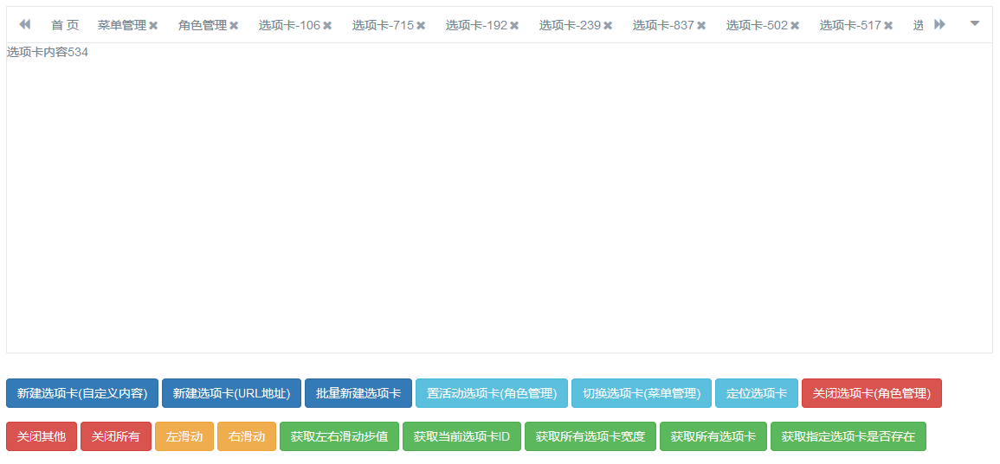

Multifunctional tab plugin based on bootstrap






# other dependencies
> Scrollbar jquery.scrollbar
> icon font-awesome

# background
When developing a project, I need a multi-tab plug-in. After searching on the Internet, it is basically a confusing version that is too ugly, too old, has too few functions, has many bugs, and is integrated in the framework. None of them can meet my needs, so I can only make one myself. I wrote this plug-in according to my own needs. The function positioning of the plug-in is mainly to meet my personal needs. If you have more needs, you can add and modify it yourself. If there is a bad writing or a BUG, please raise issues. If you think it is right for you Useful, please start.
# Instructions for use
## CSS
```
<link href="https://cdn.bootcss.com/bootstrap/3.3.5/css/bootstrap.min.css" rel="stylesheet">
<link href="https://cdn.bootcss.com/font-awesome/4.4.0/css/font-awesome.min.css" rel="stylesheet">
<link href="https://cdn.bootcss.com/jquery.scrollbar/0.2.11/jquery.scrollbar.min.css" rel="stylesheet">
<link href="css/nth-tabs.css" rel="stylesheet">
<link href="css/nth-icons.css" rel="stylesheet">
```
## JS
```
<script src="https://cdn.bootcss.com/jquery/2.1.4/jquery.min.js"></script>
<script src="https://cdn.bootcss.com/bootstrap/3.3.5/js/bootstrap.min.js"></script>
<script src="https://cdn.bootcss.com/jquery.scrollbar/0.2.11/jquery.scrollbar.min.js"></script>
<script src="js/nth-tabs.js"></script>
```
## HTML
```
<div class="nth-tabs" id="custom-id"></div>
```
## Initialization
```
nthTabs = $("#custom-id").nthTabs();
```
## New tab
```
nthTabs.addTab({
     id: 'menu-manage',
     title: 'Menu Management',
     content: 'This is the menu management page~',
     //url: "http://www.nethuige.com",
     active: true, // Whether to activate the state, the default is
     allowClose: true, //Whether it can be closed, the default is
     location: false, //Whether to automatically locate, the default is
     fadeIn: true //Whether to enable the fade in and fade out effect, the default is
});
```
## Quickly create a new custom content tab
```
nthTabs.addTab({
     id: "web-site",
     title: 'URL tab',
     url: "http://www.nethuige.com"
});
```
## Quickly create a custom URL tab
```
nthTabs.addTab({
     id: "web-site",
     title: 'URL tab-' + id,
     url: "http://www.nethuige.com"
});
```
## Create a new unclosable tab
```
nthTabs.addTab({
     id: 'home',
     title: 'Home',
     content: 'Here is the home page',
     allowClose: false
});
```
## Create a new inactive tab
```
nthTabs.addTab({
     id: 'role-manage',
     title: 'Role Management',
     active: false,
     content: 'This is the role management page~'
});
```
## Create multiple tabs - continuous operation
```
nthTabs.addTab({
     id: 'menu-manage',
     title: 'Menu Management',
     active: false,
     content: 'This is the menu management page~'
}).addTab({
     id: 'role-manage',
     title: 'Role Management',
     active: false,
     content: 'This is the role management page~'
});
```
## Create multiple tabs - batch operation
```
nthTabs.addTabs([{
     id: 'user-manage',
     title: 'User Management',
     content: 'This is the user management page~'
}, {
     id: 'auth-manage',
     title: 'Privilege Management',
     content: 'This is the permission management page~'
}]);
```
## Delete a tab
```
nthTabs.delTab('id');
```
## Remove other tabs
```
nthTabs. delOtherTab();
```
## Delete all tabs
```
nthTabs. delAllTab();
```
## Activate the specified tab
```
nthTabs.setActTab(id);
```
## Switch to the specified tab
```
nthTabs.toggleTab(id);
```
## Navigate to the current tab
```
nthTabs. locationTab();
```
## Swipe left
```
$('.roll-nav-left').click();
```
## Swipe right
```
$('.roll-nav-right').click();
```
## Get left and right sliding step value
```
nthTabs.getMarginStep();
```
## Get the current tab ID
```
nthTabs.getActiveId();
```
## Get all tab widths
```
nthTabs.getAllTabWidth();
```
## Get all tabs
```
nthTabs. getTabList();
```
## Get whether the specified tab exists
```
nthTabs.isExistsTab();
```

## tip

